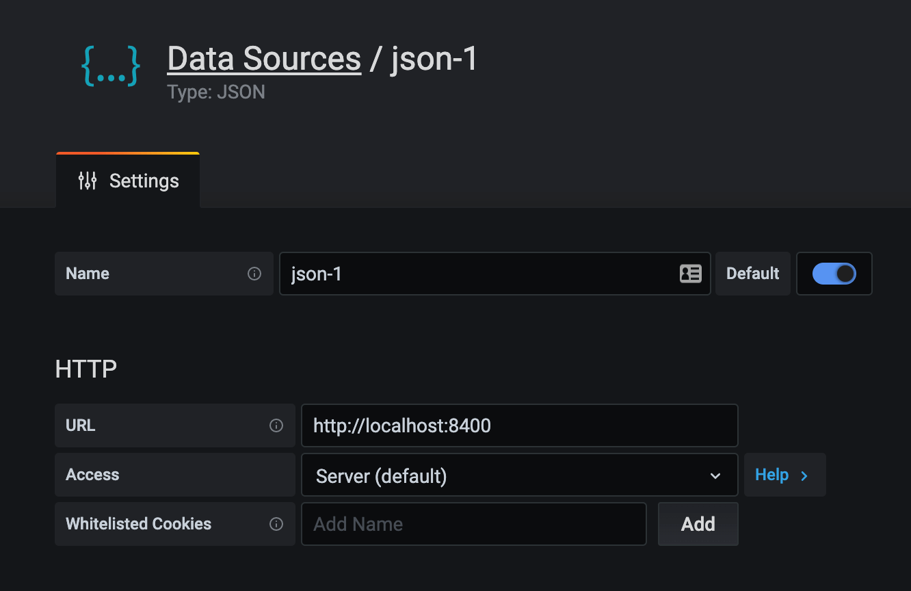

## @naturalcycles/grafana-lib

> Exposes CommonDB as [Grafana Json Datasource](https://github.com/simPod/grafana-json-datasource)
> (express middleware)

[](https://www.npmjs.com/package/@naturalcycles/grafana-lib)
[](https://circleci.com/gh/NaturalCycles/grafana-lib)
[](https://github.com/prettier/prettier)

# Example

```typescript
import { createDefaultApp, startServer } from '@naturalcycles/backend-lib'
import { FileDB } from '@naturalcycles/db-lib/dist/adapter/file'
import { GithubPersistencePlugin } from '@naturalcycles/github-db'
import { createGrafanaJsonDatasourceHandler } from '@naturalcycles/grafana-lib'
import { pHang } from '@naturalcycles/js-lib'
import { runScript } from '@naturalcycles/nodejs-lib/dist/script'

runScript(async () => {
  // 1. Have your CommonDB ready
  export const githubDB = new FileDB({
    plugin: new GithubPersistencePlugin({
      repo: 'NaturalCycles/github-db',
      forcePush: false,
    }),
  })

  // 2. Create grafanaHandler
  const grafanaHandler = createGrafanaJsonDatasourceHandler({
    db: githubDB,
  })

  // 3. Run Express server with grafanaHandler on 'http://localhost:8400/'
  await startServer({
    port: 8400,
    expressApp: createDefaultApp({
      resources: [grafanaHandler],
    }),
  })

  await pHang()
})
```

This simple Express server with Grafana middleware allows to connect to it via Grafana UI as "Json
Datasource".


